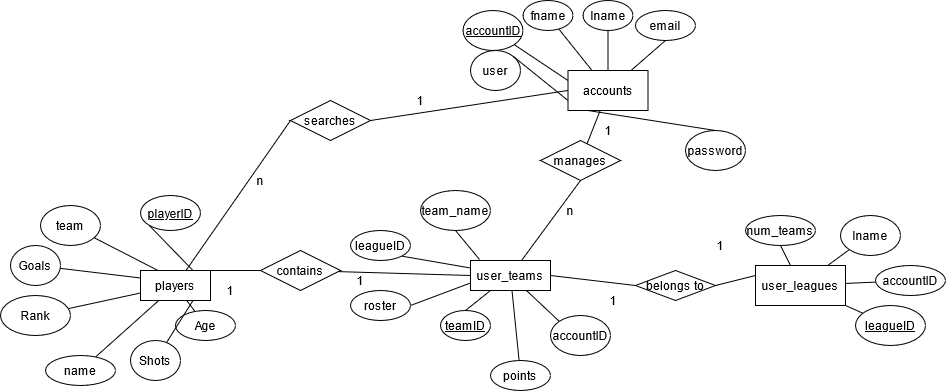

# Database_league
 Very basic setup but using SQL, twig, php, and bootstrap created a fantasy league database system
 To see it in action use https://john4064.rhody.dev/fifa/
Login credentials:
bard:Panda1234
john4064:Panda1234
No league/team
strada:Panda

<h2>Er Diagram</h2>
 
<h2>Relational Database Diagram</h2>

 
<h2>Sample Queries:/h2>
<b>Returns the number of players on teams with players shooting above 20% by alphabetical order Query:</b>
SELECT players.team, COUNT(players.team) as 'Players Above 20%' FROM players WHERE players.goals/players.shots>.18 GROUP BY players.team ORDER BY players.team ASC

<b>Returns fantasy teams where over 30 points have been scored and their current player is under the age of 29. Sorted by age youngest to oldest. Query:</b>
SELECT ut.team_name, players.name, ut.points, players.age from user_teams as ut INNER JOIN players on ut.roster = players.playerID WHERE ut.points>30 and players.age<29 ORDER BY players.age ASC

<b>Returns the name of the player on the users team This is used to let users know what the players name is that is on their roster. Query:</b>
SELECT players.name FROM players INNER JOIN user_teams ON players.playerID=user_teams.roster WHERE user_teams.accountID = ?
